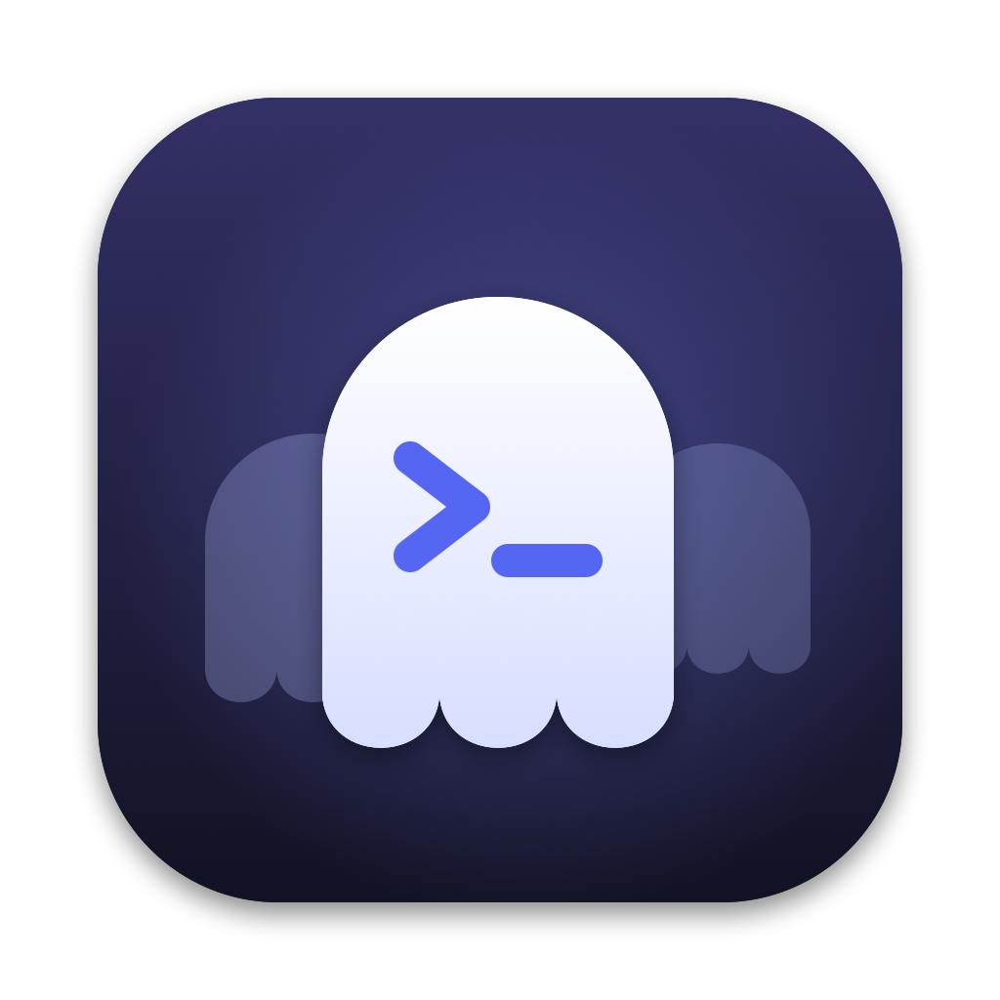
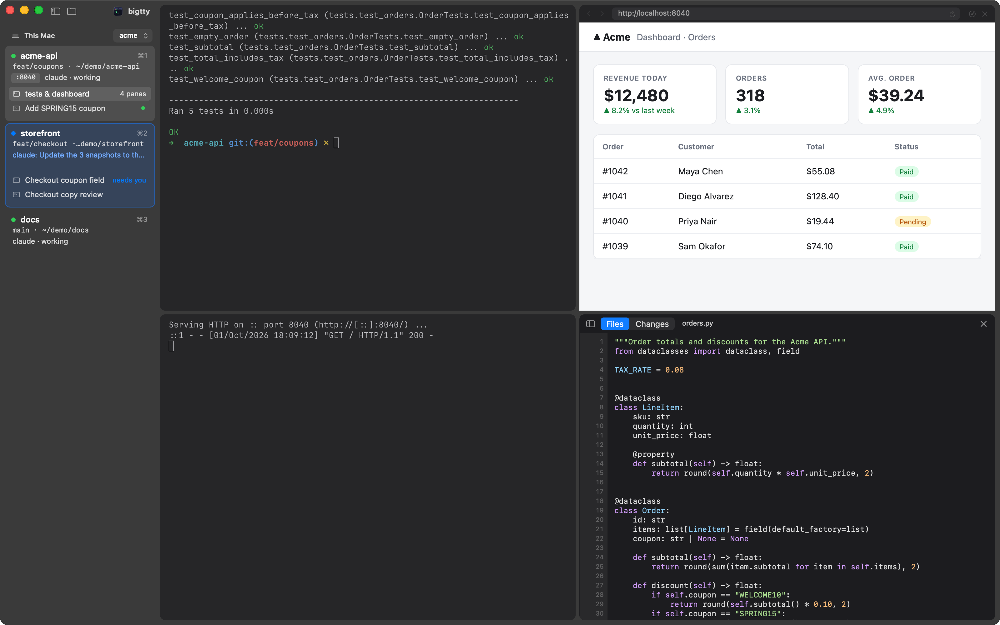
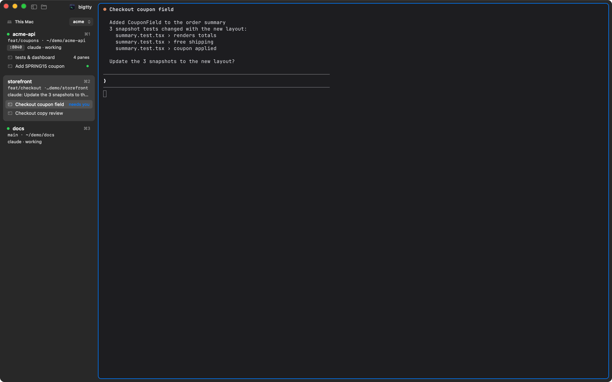
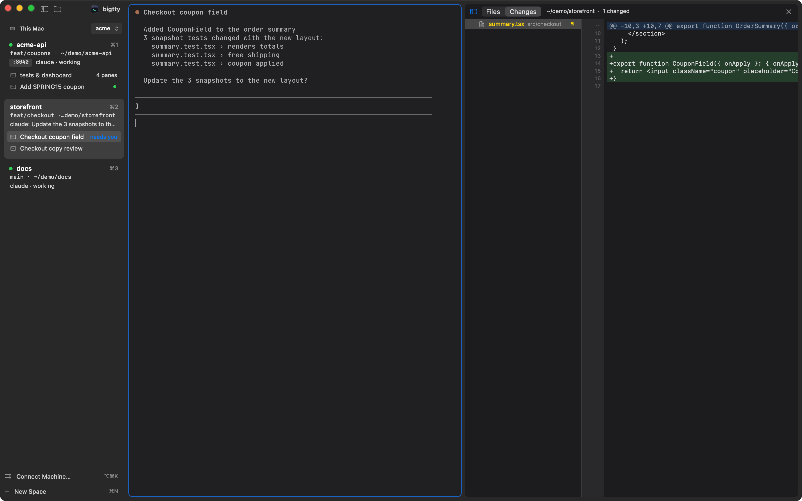
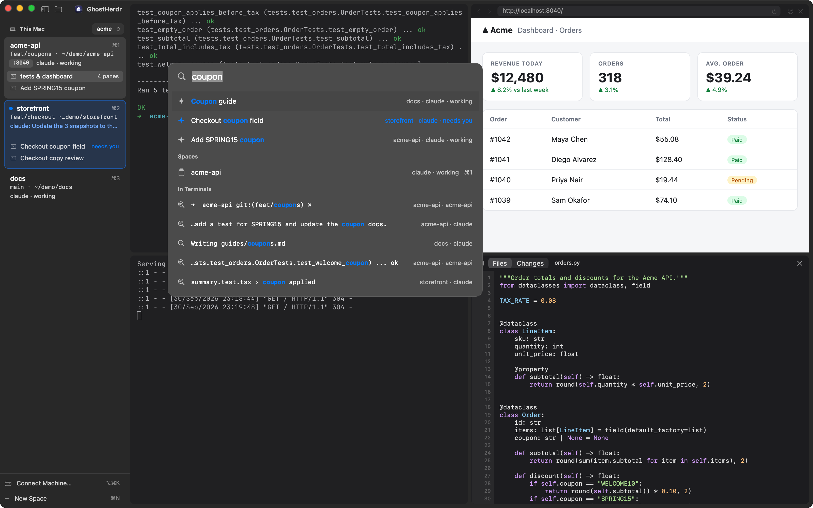
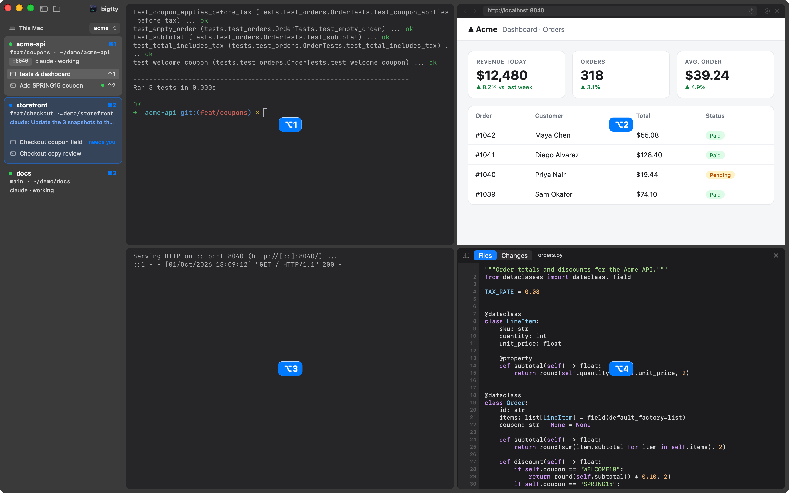
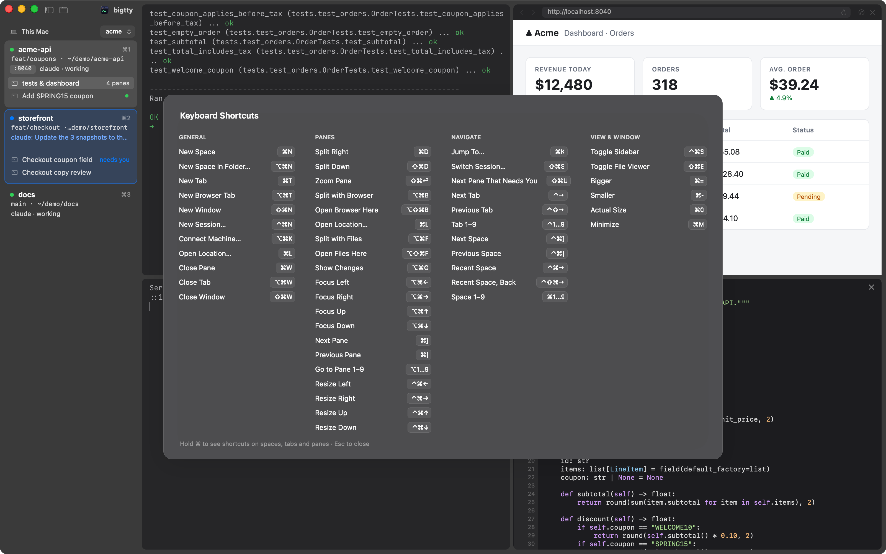
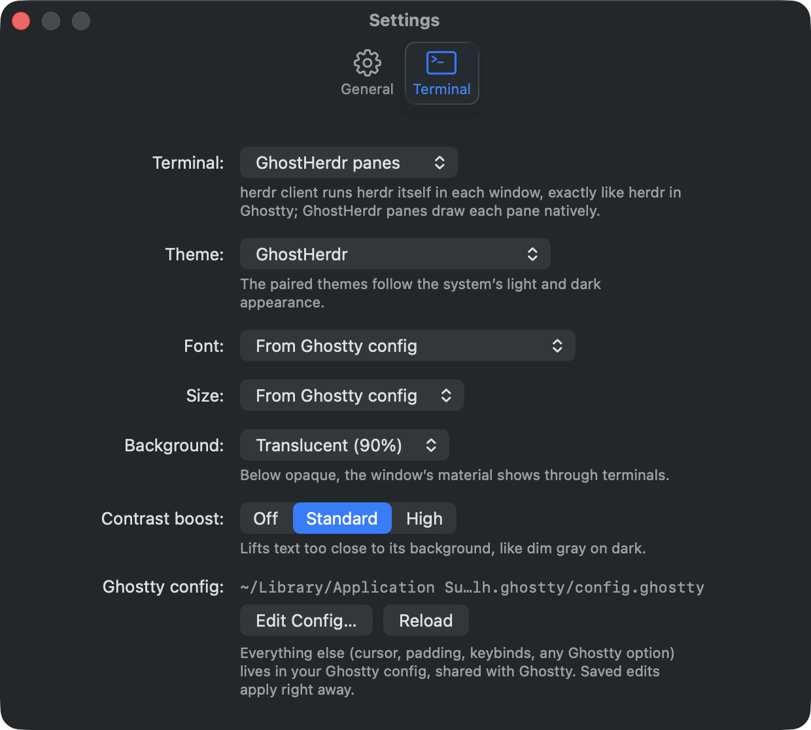

<p align="center">
  
</p>

<h1 align="center">GhostHerdr</h1>

<p align="center">
  <b>A native Mac home for your terminal agents.</b><br>
  <a href="https://herdr.dev">herdr</a>'s sessions, spaces and agents, in Ghostty-rendered terminals,<br>
  with a browser, a code viewer and every machine you work on, one keystroke away.
</p>

<p align="center">
  <a href="https://github.com/v1k45/ghostherdr/releases/latest"><b>Download for macOS</b></a> ·
  <a href="#install">Install</a> ·
  <a href="#keyboard-shortcuts">Shortcuts</a> ·
  <a href="#build-from-source">Build</a>
</p>



You run Claude Code, Codex and friends in herdr because it keeps them alive:
sessions survive, panes persist, agents report what they're doing. GhostHerdr
gives that herd a proper Mac app. Every space in a sidebar, every agent's state
at a glance, real Ghostty terminals, and the tools you keep switching windows
for (a browser, your code, the diff) right next to the agent that needs them.

Close the app and nothing stops: herdr owns every session, tab, pane and agent.
GhostHerdr is the window onto it.

## Why GhostHerdr

- **Know which agent needs you.** Each space shows its branch, folder, open
  ports and what its agents are doing. When one is waiting on you, its space
  lights up with the actual question, its pane gets a ring, and a notification
  finds you. ⇧⌘U jumps straight there.
- **Real Ghostty terminals.** Rendering by libghostty, your Ghostty config
  (fonts, keybinds, themes) as is, every one of Ghostty's hundreds of themes
  built in, and a frosted, translucent look that matches the Mac around it.
- **A browser beside the agent.** Browser panes live in the same split layout
  as your terminals. Open `localhost` next to the dev server, watch the page
  change, go full screen inside the pane. Agents can drive it too:
  `ghr browser click @e5`.
- **Code and diffs without leaving.** ⌘-click any path an agent prints (even a
  bare `Cart.tsx` in a table) and it opens right there: syntax highlighted,
  at the line, images and PDFs previewed. The Changes pane shows the git diff
  as it happens.
- **Every machine in one sidebar.** Connect a server over SSH and its spaces
  sit under yours: terminals, agents, attention, browser panes that reach its
  `localhost`, its files. One app, all your boxes.
- **Keyboard first, mouse friendly.** ⌘K jumps to any space, agent, pane or
  action. Hold ⌘ to see shortcuts on everything; ⌘/ lists them all. Drag panes
  by their top edge to rearrange a layout any way you like.
- **Native, not a web view in a trench coat.** Swift and AppKit throughout:
  sidebar material, trackpad scrolling, select-to-copy, Mac shortcuts and
  menus.

## Screenshots

| | |
|---|---|
|  |  |
| **Attention that finds you.** The storefront agent is asking a question; its space says so, word for word. | **The diff next to the decision.** Changes on the right, the agent's question below. |
|  |  |
| **⌘K to anywhere.** Spaces, agents and their state, panes, actions. | **Hold ⌘.** Every space, tab and pane shows its shortcut. |
|  |  |
| **⌘/** lists every shortcut, always in sync with the menus. | **Make it yours.** Themes, fonts, translucency, contrast, Ghostty config. |

## Install

GhostHerdr needs **macOS 14 or later** and **herdr 0.9.2 or later**
([install herdr](https://herdr.dev)). It's a universal app (Apple Silicon and
Intel).

1. Download the disk image from [Releases](https://github.com/v1k45/ghostherdr/releases/latest)
   and drag GhostHerdr into Applications. With the GitHub CLI:
   ```sh
   gh release download -R v1k45/ghostherdr -p 'GhostHerdr-*.dmg'
   open GhostHerdr-*.dmg
   ```
2. Open GhostHerdr. It finds herdr on your `PATH` or in `~/.local/bin` and
   connects to your default session; start herdr from the app if it isn't
   running.

> The app is ad-hoc signed, not notarized. Downloads via `gh` open directly;
> if you downloaded it in a browser, clear the quarantine flag once:
> `xattr -dr com.apple.quarantine /Applications/GhostHerdr.app`

If herdr is older than 0.9.2 (here, or on a machine you connect to),
GhostHerdr says so and shows the update command: `herdr update --handoff`
upgrades it and keeps your running panes alive.

## A two-minute tour

1. **⌘N** starts a space in the current folder; **⌘T** a tab; **⌘D** / **⇧⌘D**
   split right / down.
2. Run an agent in a pane. Its state shows on the space card; if it stops to
   ask something, the question appears there too.
3. **⌥⌘B** splits in a browser (**⇧⌥⌘B** turns the current pane into one,
   **⌥⌘T** opens a browser tab). **⌘L** focuses the address bar.
4. **⌘-click** a path in the terminal to open it in a files pane; **⌥⌘G** shows
   the git changes.
5. Grab a pane's top edge and drop it on another pane's edge to rearrange, or
   on the window's outer edge to make it span the whole width.
6. **⌥⌘K** connects another machine over SSH.
7. Hold **⌘** to see what else is a keystroke away.

## Keyboard shortcuts

| Keys | Action |
|---|---|
| ⌘K | Jump to any space, agent, pane or action |
| ⌘/ · hold ⌘ | All shortcuts · shortcut badges in place |
| ⌘1–9 · ⌃⌘] / ⌃⌘[ | Space by number · next / previous space |
| ⌃1–9 · ⌃⇥ / ⌃⇧⇥ | Tab by number · next / previous tab |
| ⌥1–9 · ⌘] / ⌘[ · ⌥⌘ arrows | Pane by number · next / previous pane · pane in a direction |
| ⌘D / ⇧⌘D · ⇧⌘↩ | Split right / down · zoom pane |
| ⌃⌘ arrows | Resize pane |
| ⌘T · ⌥⌘T · ⌘N | New tab · new browser tab · new space |
| ⌥⌘B · ⇧⌥⌘B · ⌘L | Split with browser · browser here · address bar |
| ⌥⌘F · ⇧⌥⌘F · ⌥⌘G | Split with files · files here · git changes |
| ⌘W · ⌥⌘W | Close pane · close tab |
| ⇧⌘U | Next pane that needs you |
| ⌥⌘K | Connect a machine |
| ⌃⌘S · ⌘, | Toggle sidebar · settings |

The pane-number modifier (⌥ or ⌥⌘) is a setting.

## Features in depth

### Terminals

Every pane is a Ghostty surface. Your Ghostty config
(`~/.config/ghostty/config.ghostty` or Ghostty's other usual places) applies
as is, and saved edits take effect immediately. On top, **Settings ▸ Terminal**
picks a theme (curated light/dark pairs or any of Ghostty's collection,
bundled from [iTerm2-Color-Schemes](https://github.com/mbadolato/iTerm2-Color-Schemes)),
font, size, background translucency, contrast boost and copy on select.
`theme = Name` and `theme = light:A,dark:B` in your config just work.
`GHOSTHERDR_GHOSTTY_CONFIG=/path` keeps a separate config for GhostHerdr.

Clicks, hover, scrolling and pastes reach apps like Claude Code, vim and htop
the way they do in Ghostty. Prefer herdr's own interface? **Settings ▸
Terminal ▸ herdr client** runs herdr itself in each window, with the native
sidebar, palette and browser around it.

### Attention and notifications

herdr reports each agent's state; GhostHerdr turns it into a ring on the pane,
a highlighted space with the agent's own question, a Dock badge and a
notification (for panes you aren't looking at). Once you've seen it, it goes
quiet until the agent needs you again.

### Browser panes

A browser pane is a real herdr pane (tagged, running a small placeholder), so
splitting, zooming, moving and closing work like any pane, and layouts survive
restarts. It identifies as Safari, plays media with a speaker on its tab, and
video full screen fills the pane (or the display, if you prefer). Terminal
links open in the tab's browser pane or in your default browser (a setting).

### Files and changes

⌘-click a path, `ghr open path:line`, or **⌥⌘F**: the file opens at the line,
highlighted, with images and PDFs previewed; the tree is a click away. The
Changes pane (**⌥⌘G**, `ghr diff`) lists what git sees as changed with each
diff, refreshed live. Right-click a file to insert its path into the terminal.

### Remote machines

**File ▸ Connect Machine…** takes any SSH target (`user@host`, `host:port`, an
`~/.ssh/config` alias). GhostHerdr checks it, can start herdr there, and keeps
one SSH connection forwarding herdr's sockets, so everything works as it does
locally: terminals, agents, attention, ⌘K, files panes, and browser panes that
reach the machine's `localhost` (the address bar still says `localhost:3000`).
It uses your SSH keys and agent; machines saved with `herdr machine add`
appear on their own.

### Agents driving the browser: `ghr`

**GhostHerdr ▸ Install ghr and Agent Skill…** puts `ghr` on your `PATH` and
teaches your agents to use it:

```sh
ghr browser open localhost:3000     # beside the agent, or this tab's browser
ghr browser snapshot -i             # - textbox "Email" [ref=e3] …
ghr browser fill @e3 me@example.com
ghr browser click @e5
ghr browser wait --text "Welcome"
ghr browser screenshot out.png --open
ghr open src/app.py:42              # show a file beside the agent
ghr diff                            # show the repo's changes
```

Also `type`, `press`, `select`, `check`, `scroll`, `hover`, `get`, `eval`,
`console`, `navigate`, `back`, `forward`, `reload`, `list`, `close`, and
`--json`. Commands go over a user-only socket; the page script runs in an
isolated JavaScript world.

## Build from source

Needs Xcode 26 (Swift 6.2+).

```sh
scripts/bundle.sh                 # dev build → build/GhostHerdr.app
open build/GhostHerdr.app
scripts/release.sh 0.2.0          # universal release → build/release/GhostHerdr-0.2.0.{dmg,zip}
```

`GHOSTHERDR_SESSION=<name>` connects to a named herdr session.

## How it works

- **HerdrKit** speaks herdr's NDJSON socket API (`session.snapshot`,
  `layout.export`, `events.subscribe`, `pane.*`). Events trigger a re-read,
  never a delta.
- Each visible pane runs `herdr terminal session control` and feeds its frames
  into a Ghostty surface with a host-managed backend; keys, clicks, scrolls and
  pastes go back as herdr terminal commands.
- Browser and files panes are herdr panes tagged `ghr_kind`, so herdr's layout
  stays the single source of truth for every pane.
- Remote machines are herdr sockets forwarded over SSH; the rest of the app
  doesn't know the difference.

## Development

```sh
swift test                                  # unit tests
herdr --session ghrtest server &            # isolated server for live tests
GHR_TEST_SESSION=ghrtest swift test         # + live socket/terminal tests
```

Debug hooks on a running app: `kill -USR1 <pid>` writes window, pane and
on-screen terminal text to `$TMPDIR/ghostherdr-debug.txt` (plus a window
render); `kill -USR2 <pid>` pastes `$TMPDIR/ghostherdr-type.txt` into the
focused pane, or, starting with `!`, sends a menu action
(`!@<space> newBrowserPane:`). Quit the app with `pkill -x GhostHerdr`
(`pkill -f GhostHerdr.app` also kills the placeholders inside herdr panes).

## Credits

Built on [herdr](https://herdr.dev), [Ghostty](https://ghostty.org) via
[libghostty-spm](https://github.com/Lakr233/libghostty-spm), and themes from
[iTerm2-Color-Schemes](https://github.com/mbadolato/iTerm2-Color-Schemes).
GhostHerdr is MIT licensed.
