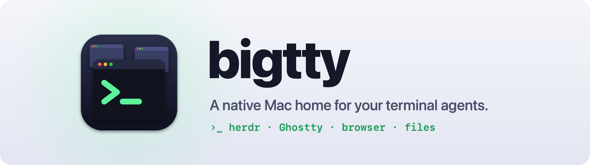
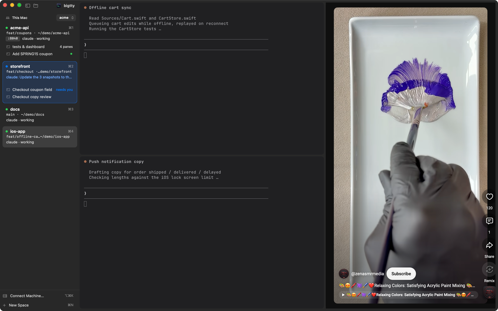
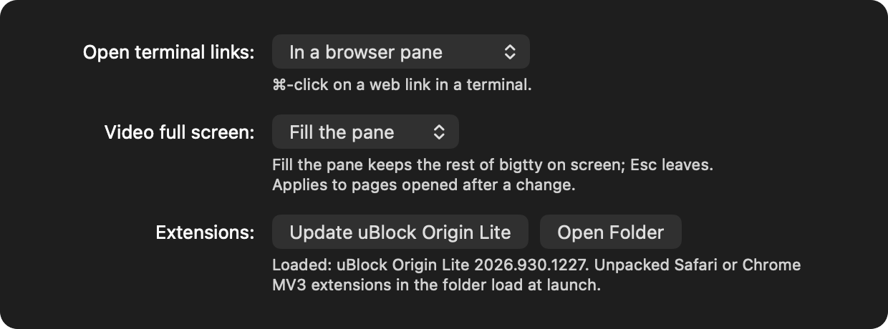

<picture>
  <source media="(prefers-color-scheme: dark)" srcset="docs/banner-dark.png">
  
</picture>

<p align="center">
  <a href="https://github.com/v1k45/bigtty/releases/latest"><b>Download for macOS</b></a> ·
  <a href="#install">Install</a> ·
  <a href="docs/features.md">Features</a> ·
  <a href="docs/shortcuts.md">Shortcuts</a> ·
  <a href="docs/btty.md">btty</a>
</p>

<p align="center">
  
  
  
  
</p>


Claude Code, Codex and friends run in [herdr](https://herdr.dev) because it
keeps them alive. **bigtty** gives that herd a proper Mac app: every space in a
sidebar, every agent's state at a glance, real Ghostty terminals, and a
browser and your code right next to the agent that needs them. Quit it and
nothing stops; herdr keeps running everything.

<br>

## Know which agent needs you

Each space shows its branch, ports, what its agents are doing and how long
it's been quiet. When one stops to ask something, its space quotes the
question, its pane gets a ring and a notification finds you. **⇧⌘U** jumps
there.


## The diff next to the decision

**⌘-click** any path an agent prints and it opens right there, at the line.
**⌥⌘G** shows what changed, live, beside the agent asking whether to keep it.


## ⌘K to anywhere

Fuzzy search over spaces, agents, panes and actions, and through everything
your terminals printed.


## A browser in the layout

Browser panes split, zoom and move like terminals. Open `localhost` beside the
dev server, block ads with uBlock Origin Lite, let agents drive it with
[`btty browser`](docs/btty.md), or keep a Short playing while the agents grind.



## Keyboard first

<table>
  <tr>
    <td width="50%"></td>
    <td width="50%"></td>
  </tr>
  <tr>
    <td align="center">Hold <b>⌘</b>: every space, tab and pane shows its key.</td>
    <td align="center"><b>⌘/</b> lists them all.</td>
  </tr>
</table>

## Made to fit your Mac

Your Ghostty config as is, hundreds of themes built in, translucency, fonts,
notification sounds, and SSH machines whose spaces sit right under yours.

<table>
  <tr>
    <td width="50%"></td>
    <td width="50%"></td>
  </tr>
</table>

<br>

## Install

Needs **macOS 14+** and **[herdr](https://herdr.dev) 0.9.2+**. Universal
(Apple Silicon and Intel).

```sh
gh release download -R v1k45/bigtty -p 'bigtty-*.dmg' && open bigtty-*.dmg
```

Drag bigtty to Applications and open it; it finds herdr and connects to your
default session. Downloaded in a browser instead? The app is ad-hoc signed, so
clear the quarantine flag once:
`xattr -dr com.apple.quarantine /Applications/bigtty.app`.

## Quick start

| | |
|---|---|
| **⌘N** · **⌘T** · **⌘D** | New space · tab · split |
| **⌥⌘B** · **⌥⌘F** · **⌥⌘G** | Browser · files · git changes beside you |
| **⌘K** · **⇧⌘U** | Jump anywhere · next agent that needs you |
| **⌘1–9** · **⌃⌘⇥** | Your spaces · back to the last one |
| **⌥⌘K** · **⇧⌘S** | Connect a machine · switch session |

Drag a pane by its top edge to rearrange. Everything else:
[shortcuts](docs/shortcuts.md).

## Learn more

- [Features in depth](docs/features.md): terminals, spaces, attention, browser
  panes and extensions, files, sessions, remote machines, how it works
- [btty](docs/btty.md): the command agents use to drive bigtty's browser and
  open files
- [Building and development](docs/development.md)

Built on [herdr](https://herdr.dev), [Ghostty](https://ghostty.org) via
[libghostty-spm](https://github.com/Lakr233/libghostty-spm), and themes from
[iTerm2-Color-Schemes](https://github.com/mbadolato/iTerm2-Color-Schemes).
MIT licensed.
